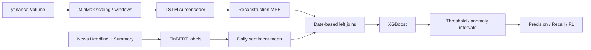

# Market Anomaly Research

거래량 시계열의 LSTM 재구성 오차와 FinBERT 뉴스 감성을 날짜별로 결합해 XGBoost로 이상 구간을 분류한 탐색적 연구입니다.

**강점: 시계열·텍스트 결합과 모델별 실패 사례 분석. 한계: 현재 실험은 데이터 누수 가능성이 있어 일반화 성능으로 해석할 수 없습니다.** 과목명은 블록체인과 딥러닝 응용이지만 확보한 코드에서 블록체인 구현은 확인되지 않습니다.

## Research Question / Motivation

거래량만으로 포착하기 어려운 이상 구간을 뉴스 감성으로 보완할 수 있는가? 기존 논문에서 제시한 조작 구간을 기준으로 5개 종목을 분석했습니다. 조기 탐지와 실제 시세조종 판정은 별도의 검증 과제입니다.

## Recruiter Snapshot

| 항목 | 내용 |
| --- | --- |
| 프로젝트 유형 | 과목 연구 논문·실험 Notebook |
| 역할 | 임나경 명의 발표/과제 자료. 개인 연구의 코드·실험 기록, 외부 데이터와 참고 논문은 별도 |
| 기술 | Python, pandas, yfinance, Keras LSTM, Transformers FinBERT, scikit-learn, XGBoost |
| 데이터 | AEMD/APPB/GME/NBDR/TRBO 거래량 및 뉴스 CSV |
| 핵심 구현 | 날짜 정렬, 감성 평균, 재구성 오차, 특징 결합, threshold 비교 |
| 결과 | 저장된 Notebook 출력만 보존. 학습 재실행 및 독립 테스트 검증 미완료 |

## Related Work / References

원본은 Tallboys 등의 “Identification of Stock Market Manipulation with Deep Learning”을 참고합니다. 자료 사이에 학회 연도/서지 정보 표기가 달라 정식 인용 정보는 확인 필요입니다. 출판사 PDF와 뉴스 원문은 포함하지 않았습니다. 정확한 출판 정보와 공개 권한 확인 전 `CITATION.cff`를 만들지 않았습니다.

## Proposed Method / Architecture

아래 흐름은 `src/legacy_experiment.py`와 통합 Notebook 코드에서 확인했습니다.



## Dataset / How It Works

코드는 yfinance에서 각 종목의 거래량을 읽습니다. 뉴스 CSV의 `Headline`과 `Summary`를 합쳐 `ProsusAI/finbert`의 positive/neutral/negative를 1/0/-1로 변환하고 날짜별 평균을 계산합니다. LSTM MSE와 감성 특징을 날짜별로 left join한 뒤 결측을 0으로 채웁니다. 논문이 제안한 뉴스 긍정 비율·텍스트량과 코드의 실제 계산에는 차이가 있습니다.

뉴스 본문·요약·증강 CSV의 재배포 권리가 불명확하므로 [데이터 명세](data/README.md)만 제공합니다. 개인 투자·거래 내역은 사용하지 않았다는 보장은 원자료 검증 전까지 하지 않으며, 공개본에는 거래 계정 데이터가 없습니다.

## Model Architecture / Experimental Setup

LSTM(hidden=80, relu) → RepeatVector(window) → LSTM(return_sequences=True) → TimeDistributed(Dense(1)), Adam/MSE를 사용합니다. 통합 코드의 window 후보는 5/10/20/50/100/250, epoch 후보는 10/35/70, batch는 64입니다. FinBERT는 사전학습 분류기를 불러와 추론하며 해당 코드에서 추가 파인튜닝은 확인되지 않습니다. XGBoost는 클래스 불균형 가중치를 사용합니다.

논문은 시간순 7:1:2 분할을 설명하지만 통합 코드는 stratified random 70:30 분할입니다. AE는 전체 입력으로 학습하고 같은 입력에서 MSE를 계산합니다. 이 차이를 숨기지 않고 [평가 감사](docs/evaluation-audit.md)에 기록했습니다.

## My Contribution / Contribution

개인 명의 연구 자료에 시계열 이상 탐지, 뉴스 감성 집계, 날짜별 특징 결합, 모델 비교가 포함되어 있습니다. 참고 연구의 벤치마크 제작이나 FinBERT 사전학습 자체를 개인 기여로 포함하지 않습니다. 파일별 Git 작성 이력은 제공 자료에 없어 확인 필요입니다.

## Results

다음은 원본 `분석 데이터(autoencoder, 감성분석, xgboost).ipynb`의 저장된 출력(cell index 13/17/30)입니다. **동일한 독립 테스트셋 비교가 아니며, 재실행 결과가 아닙니다.** 다른 통합 Notebook에는 다른 값도 있어 가장 높은 수치만 선택하지 않았습니다.

| 종목 | AE F1 | 감성 F1 | XGBoost F1 |
| --- | ---: | ---: | ---: |
| AEMD | 0.000 | 0.000 | 0.727273 |
| APPB | 0.516 | 0.182 | 0.800000 |
| GME | 0.690 | 0.545 | 0.461538 |
| NBDR | 0.828 | 0.444 | 0.714286 |
| TRBO | 0.583 | 0.333 | 0.800000 |

통합이 모든 종목에서 개선되지 않는다는 관찰은 가능합니다. 그러나 데이터 분할·튜닝 절차 차이 때문에 개선율이나 우월성의 근거로 사용하지 않습니다. [원본 출력 발췌](docs/historical-results.txt)에 다른 실험 출력도 출처별로 보존합니다.

## Getting Started

```bash
git clone https://github.com/YIM551/market-anomaly-research.git
cd market-anomaly-research
python scripts/check_sources.py
```

위 명령은 외부 API·학습 없이 Python 문법과 Notebook 구조를 검사합니다. 학습 실행 성공을 의미하지 않습니다.

실험 검토용 의존성 목록은 `requirements.txt`에 있습니다. 원본 lock/version 정보가 없어 고정하지 않았으며, 검증된 재현 환경이 아닙니다. 코드에 f-string이 있어 Python 3가 필요합니다. 원본 Notebook의 Python 2.7.6 메타데이터는 코드와 모순되어 Python 3 커널 표시로 정리했습니다.

라이선스가 허용된 데이터를 `data/raw/{TICKER}_augmented.csv`로 준비한 뒤 Notebook을 검토할 수 있습니다. `src/legacy_experiment.py`를 실행하면 모델 다운로드, 외부 시세 요청과 다수 학습이 발생합니다. 원자료 없이는 실행할 수 없고 현재 역사적 결과 재현은 검증하지 않았습니다.

## Project Structure

```text
src/legacy_experiment.py       # 원본 통합 실험; 경로만 정리
notebooks/integrated.ipynb     # 통합 실험, 출력 분리
notebooks/exploration.ipynb    # 탐색 실험; 역사적 순서 보존
scripts/check_sources.py      # 포트폴리오 정리 시 추가한 정적 검사
data/README.md                # 외부 데이터 명세
docs/evaluation-audit.md      # 논문-코드 불일치와 누수 점검
docs/historical-results.txt   # 원본 저장 출력 발췌
requirements.txt              # 버전 미확인 의존성 목록
```

## Technical Challenges / Discussion

날짜 단위로 서로 다른 데이터 소스를 결합한 점이 핵심입니다. 동시에 거래 없는 날짜와 뉴스 없는 날짜를 동일하게 0 처리하면 의미가 손실됩니다. `text_length`가 집계 후 상실되고 `positive_ratio`가 실제 비율이 아닌 평균 양수 여부가 되는 문제도 발견했습니다. 이 발견은 2026년 포트폴리오 검토 결과이며 당시 해결한 성과로 표현하지 않습니다.

## Limitations

전체 시계열 scaler/AE 학습, 같은 데이터에서 window/epoch 선택, random split, threshold 선택과 평가 데이터 재사용, 추론 전 시점 정렬 검증 부족이 있습니다. Notebook 실행 카운트도 비순차여서 저장 출력과 현재 셀의 일치가 보장되지 않습니다. 원본의 모델링 로직을 변경해 과거 결과를 조용히 바꾸지 않았습니다.

## Future Work

시간순 train/validation/test 분리와 train-only scaler/AE, validation-only 튜닝을 먼저 구현하고 별도 신규 실험으로 기록해야 합니다. 이후 뉴스 출처·수집시각·공시시각 보존, 결측 의미 분리, 긍정 비율/텍스트량 수정, seed/환경 고정, walk-forward 검증을 진행합니다.
