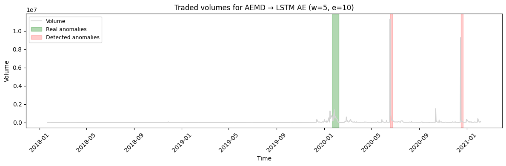
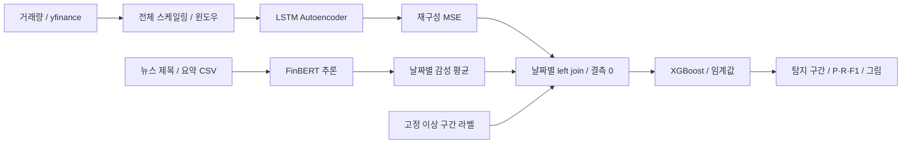

# 거래량과 뉴스 감성을 결합한 주가 이상 구간 탐지 연구

거래량의 비정상 패턴과 금융 뉴스의 감성을 날짜별로 결합해, 기존 연구가 표시한 주가 이상 구간을 탐지하는 개인 연구 프로젝트입니다.

| 항목 | 내용 |
|---|---|
| 문제 | 거래량 급증만으로는 놓치는 구간을 뉴스 감성으로 보완할 수 있는가? |
| 나의 역할 | 개인 연구의 데이터 연결, LSTM Autoencoder·FinBERT·XGBoost 실험, 결과 분석 |
| 핵심 기술 | Python, pandas, yfinance, Keras, Transformers, scikit-learn, XGBoost |
| 데이터 | 미국 5개 종목의 거래량과 뉴스. 로컬 뉴스 59행, 증강 CSV 280레코드 |
| 확인된 결과 | 모델별 미탐·오탐과 종목별 성능 차이를 기록. 독립 테스트 성능은 미검증 |
| 실행 증거 | 원본 결과 그림 10개, 저장 출력, 개인정보를 제거한 연구 원고 |



초록은 연구에서 사용한 라벨 구간, 빨강은 모델이 탐지한 구간입니다. AEMD의 미탐과 라벨 밖 오탐을 보여주는 **당시 저장 그림**입니다. 법적으로 확정된 시세조종 판정이나 새로운 재실행 결과는 아닙니다.

[구조와 데이터 흐름](docs/architecture.md) · [실험과 평가](docs/experiments.md) · [Demo 전체](docs/demo.md) · [연구 원고와 정정 사항](docs/research-errata.md) · [입력 검사 실행](docs/reproducibility.md)

## Overview / Problem

거래량이 커졌다고 모두 조작은 아니며, 거래량 변화가 작아도 문맥상 특이한 구간이 있을 수 있습니다. 이 연구는 거래량 재구성 오차와 뉴스 감성을 결합하는 방법을 탐색했습니다. 연구 목표는 조기 탐지였지만, 실제 코드는 과거 구간의 오프라인 분류 실험입니다. 조기 경보 시간이나 실제 서비스 성능은 측정하지 않았습니다.

## Solution / Key Features

- yfinance 거래량을 날짜와 함께 수집하고 슬라이딩 윈도우로 구성합니다.
- LSTM Autoencoder의 재구성 오차를 날짜별 특징으로 만듭니다.
- `ProsusAI/finbert`로 뉴스 제목·요약의 감성을 추론하고 날짜별로 집계합니다.
- 두 결과를 날짜로 결합하고 XGBoost로 라벨 구간을 분류합니다.
- 모델별 결과와 실패 사례를 보존하고, 2026년 검토에서 입력 품질·평가 한계를 추적했습니다.

## Architecture / Data Flow



이 다이어그램은 [실제 통합 코드](src/legacy_experiment.py)를 따른 것입니다. 전체 스케일링과 결측 0 처리는 역사적 구현이며, 권장되는 평가 설계라는 뜻은 아닙니다. [함수별 근거와 영향](docs/architecture.md)을 함께 설명합니다.

## My Contribution

개인 연구에서 거래량 시계열과 뉴스 감성을 결합하고, 세 종류의 탐지 결과를 비교했습니다. 데이터 준비·감성 집계·재구성 오차·분류·시각화 흐름은 공개 코드와 Notebook에 남아 있습니다. FinBERT 사전학습, 참고 논문의 라벨 제작, 외부 뉴스 저작은 개인 기여에 포함하지 않습니다. 확보된 자료만으로 원래 파일별 작성 이력을 복원할 수는 없습니다.

2026-09-10 포트폴리오 정리에서는 데이터 사전 검사와 테스트, 원고 정정 설명, 결과 그림 공개를 추가했습니다. 이 작업을 원래 실험 당시의 성과로 표현하지 않습니다.

## Dataset / Implementation

대상은 AEMD, APPB, GME, NBDR, TRBO입니다. 시세에서 실제 사용한 수치 특징은 `Volume` 하나입니다. FinBERT는 추가 학습 없이 추론에 사용했습니다. LSTM 은닉 크기는 80, batch 64이며 window 6개와 epoch 3개 후보를 비교했습니다.

확보된 뉴스 CSV에는 **AEMD의 시점·열 이름 불일치와 GME의 잘못된 CSV 행**이 있습니다. 280개는 증강 레코드 수이며 서로 독립적인 기사 280건이라는 뜻이 아닙니다. 원문 재배포 권리가 확인되지 않아 원자료는 제외하고 [출처·열·행 수·기간·검사 결과](docs/dataset.md)를 제공합니다.

## Experiments / Results

원본 탐색 Notebook의 저장 출력(cell 13/17/30)을 발췌했습니다. **동일한 독립 테스트셋 비교가 아니며 재실행한 수치도 아닙니다.**

| 종목 | AE F1 | 감성 F1 | XGBoost F1 |
|---|---:|---:|---:|
| AEMD |0.000|0.000|0.727273|
| APPB |0.516|0.182|0.800000|
| GME |0.690|0.545|0.461538|
| NBDR |0.828|0.444|0.714286|
| TRBO |0.583|0.333|0.800000|

통합 모델이 모든 종목에서 좋아지지는 않았습니다. 전체 시계열 학습, random 분할, 임계값 선택, 뉴스 날짜의 차이가 섞여 있어 우월성이나 개선율을 주장할 수 없습니다. [실험 버전과 임계값 차이](docs/experiments.md), [원본 저장 출력](docs/historical-results.txt)을 함께 보세요.

## Demo

[원본 그림 10개](docs/demo.md)에서 AE와 통합 분류의 탐지 구간을 확인할 수 있습니다. [연구 원고](docs/research/historical-paper-redacted.pdf)는 안내문 1쪽과 당시 원고 18쪽으로 구성됩니다. 원고에 남아 있는 구현·평가 주장의 오류는 [정정 설명](docs/research-errata.md)에 명시했습니다. 동영상, API 서비스, 실시간 거래 시스템은 제공 자료에 없습니다.

## Getting Started

Python 3 표준 라이브러리만으로 아래 검사를 실행할 수 있습니다. 모델이나 뉴스 다운로드가 발생하지 않습니다.

```bash
git clone https://github.com/YIM551/market-anomaly-research.git
cd market-anomaly-research
python scripts/check_sources.py
python -m unittest discover -s tests -v
```

사용 권한이 있는 뉴스를 준비했다면, 학습 전에 다음 검사를 실행합니다.

```bash
python scripts/validate_news.py --data-dir data/raw
```

검사는 CSV 열 수·필수 열·날짜·텍스트 공백·시세 요청 기간과의 겹침을 확인합니다. 오류는 exit 1을 반환하며 행을 고치거나 버리지 않습니다. 기존 모델의 누수나 뉴스 진위까지 검증하는 도구는 아닙니다. [실행 조건과 미검증 범위](docs/reproducibility.md)를 먼저 읽어 주세요.

## Project Structure

```text
src/legacy_experiment.py       # 보존한 통합 실험
notebooks/                    # 탐색/통합 코드, 원본 출력은 별도 문서
assets/                       # 당시 탐지 그림 10개
scripts/validate_news.py       # 2026년 추가한 오프라인 입력 검사
scripts/check_sources.py       # 문법과 Notebook 구조 검사
tests/                        # 합성 입력으로 검사기 동작 검증
docs/evidence/                # 입력 검사 집계와 GME 오탐 예시
docs/research/                # 개인정보 제거 연구 원고
docs/                         # 구조, 데이터, 실험, 정정, 실행 조건
data/README.md                # 입력 파일 계약
requirements.txt              # 원본 코드에서 추출한 미고정 의존성 목록
```

## Technical Challenges / Limitations

날짜가 같다는 이유만으로 두 데이터가 같은 시장 시점을 설명하지는 않습니다. AEMD 뉴스가 라벨보다 수년 뒤에 있다는 사실과, 기사 없는 날·거래 없는 날을 같은 0으로 처리하는 문제가 대표적입니다. 또한 `positive_ratio`는 실제 비율이 아니라 이진값이고 `text_length`는 집계 이후 0입니다.

실험은 전체 시계열로 전처리·AE 학습을 하고 XGBoost를 random 70:30으로 나눴습니다. 독립 test, 시간순 검증, 원본 데이터의 고정 스냅샷이 없어 금융 실무 성능으로 해석할 수 없습니다. 과목 이름과 달리 이 코드에는 블록체인 구현이 없습니다.

## Future Work

동일 시점의 사용 가능한 데이터부터 확정하고, train 전용 스케일러·AE 학습과 validation 전용 선택, 최종 test 평가를 분리해야 합니다. 다음 실험에서는 뉴스 공개 시각·증강 원문 ID, 날짜 병합 품질, 정상/이상 비율과 오탐 비용을 기록합니다. 새로운 실험 결과는 역사적 수치와 별도로 남깁니다.

## References

- Tallboys, Zhu, Rajasegarar, *Identification of Stock Market Manipulation with Deep Learning*, ADMA 2021 proceedings, published 2022, pp.408–420. [DOI](https://doi.org/10.1007/978-3-030-95405-5_29), [저자 코드·데이터](https://github.com/zhuye88/ADMA21).
- [FinBERT 모델](https://huggingface.co/ProsusAI/finbert). 정확한 모델 revision은 원본에서 복구되지 않았습니다.
- [공개 자료와 제외 정책](docs/publication-notes.md). 이 저장소에 임의의 오픈소스 라이선스를 부여하지 않았습니다.
