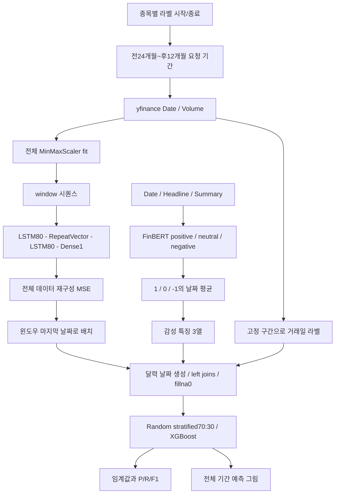

# 실제 구현의 구조와 데이터 흐름

주 실행 자료는 [`legacy_experiment.py`](../src/legacy_experiment.py)와 [`integrated.ipynb`](../notebooks/integrated.ipynb)입니다. 별도 DB, SQL, 서버, 메시지 큐, 블록체인 네트워크는 구현되지 않았습니다. 중간 결과는 메모리의 pandas DataFrame과 사전에 저장됩니다.

| 처리 | 함수/코드 위치 | 검토할 의미 |
|---|---|---|
| 수집 | 종목 루프, `Ticker.history` | Close가 아니라 Volume만 사용 |
| 뉴스 추론 | `run_finbert` | 제목과 요약 결합, 원문 출처 검증 없음 |
| 일별 집계 | `daily_sentiment` | 평균 후 원문 text는 사라짐 |
| 감성 이상 | `detect_sentiment_anomaly` | abs(z)>0.5, 전체 뉴스 기간 기준 |
| AE | `lstm_autoencoder_detect` | 정상 전용 학습이나 holdout 없음 |
| 점수 정렬 | `make_lstm_score_df` | window 마지막날에 MSE, 초기 빈 값0 |
| 추가 특징 | `make_sentiment_df` | positive_ratio는 평균>0 이진값, text_length는0 |
| 라벨 | `make_label_df` | 고정 구간의 거래일 timestamp 기준 |
| 구간화 | `extract_detected_anomalies_from_xgb` | 연속 예측 날짜를 묶음 |
| 결과 | `plot_detection_vs_real` | 전체 기간의 라벨과 탐지를 겹침 |

라벨 날짜는 TRBO 2020-03-30~04-09, APPB 2020-03-25~04-13, AEMD 2020-01-22~02-07, NBDR 2020-03-11~04-03, GME 2021-01-11~01-29입니다. 연구가 채택한 이상 구간이며 특정 기업의 법적 시세조종 판정으로 확장하지 않습니다.

데이터 흐름의 핵심은 서로 다른 신호를 날짜로 연결한 점입니다. 시세와 뉴스가 겹치지 않는 기간, 장후 뉴스, 시장 휴일, 시차, 라벨 없는 날을 구분하지 않으면 분류기가 의도하지 않은 특징을 배우게 됩니다. [데이터 감사](dataset.md)와 [평가 감사](evaluation-audit.md)를 함께 읽으세요.
