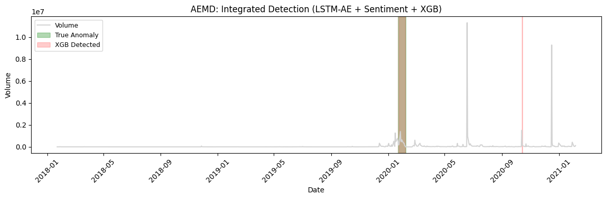
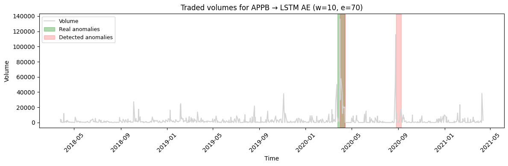
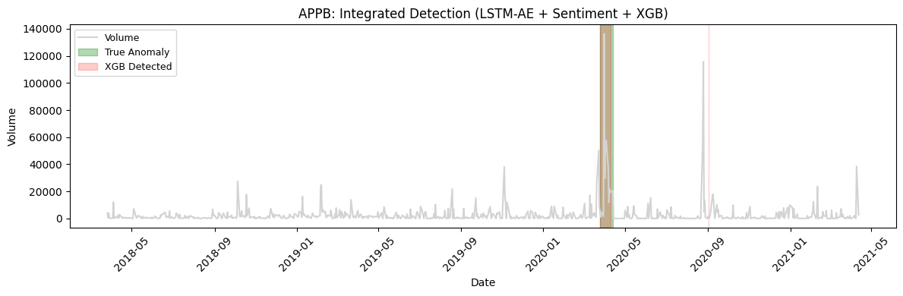
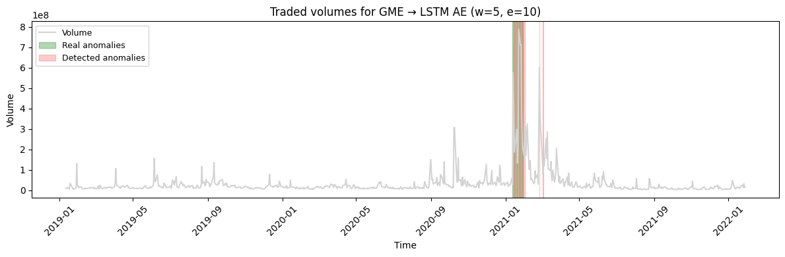
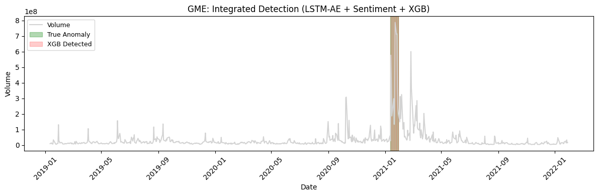
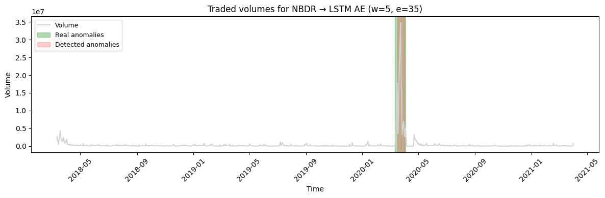
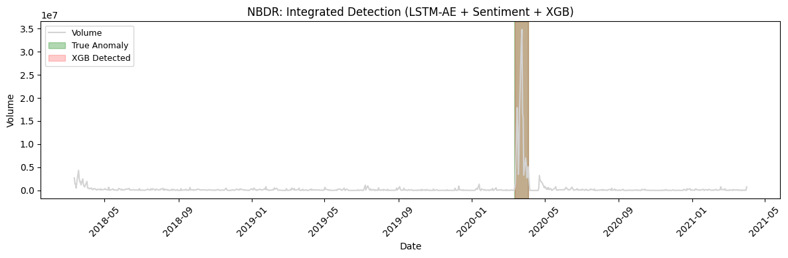
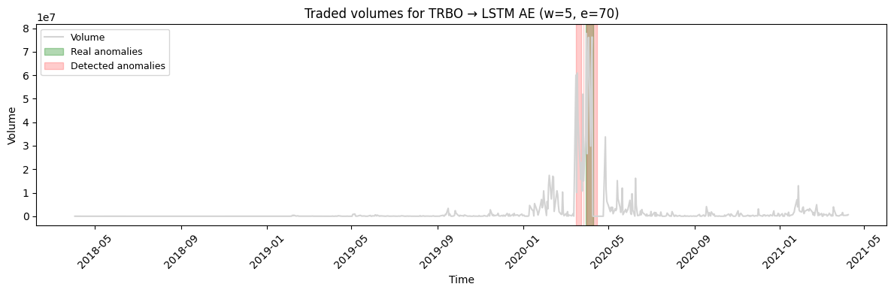
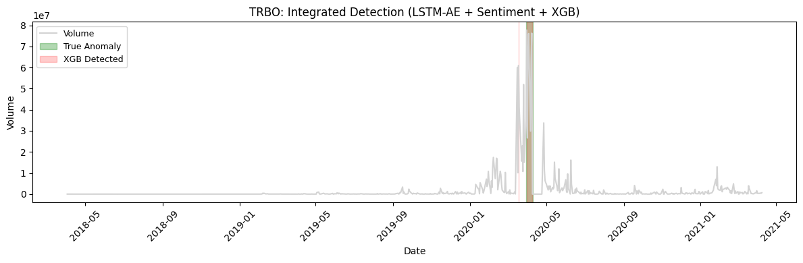

# 원본 결과 Figure로 보는 실험

아래 10개 그림은 당시 저장된 실험 산출물의 무손실 복사입니다. 초록은 연구에서 사용한 라벨 구간, 빨강은 탐지 구간입니다. 원본 SHA256은 [자산 출처](assets-provenance.json)에 기록했습니다.

그림과 표가 다른 학습 실행·임계값을 사용할 수 있으므로 탐지 패턴을 보는 자료로 사용합니다. 새로운 test 결과, 실시간 시연, 법적 조작 판정을 뜻하지 않습니다.

## AEMD

## APPB

## GME

## NBDR

## TRBO

## 그림을 설명하는 방법

AEMD AE는 초록 구간을 놓치고 뒤의 급증을 빨강으로 표시합니다. 통합 그림에서는 일부 초록 구간과 후행 오탐이 보입니다. 이것만으로 통합 모델의 독립 성능이 높아졌다고 결론 내릴 수 없습니다. TRBO AE 그림은 w5/e70 표시로, 탐색 표에서 선택한 e35와 다릅니다.

동영상/GIF는 확보된 관련 폴더와 제출 ZIP에 없었습니다. 원본 발표 자료와 논문을 검토해 [개인정보 제거 원고](research/historical-paper-redacted.pdf)도 공개했습니다. 원고를 읽을 때는 [정정 사항](research-errata.md)을 함께 확인하세요.
